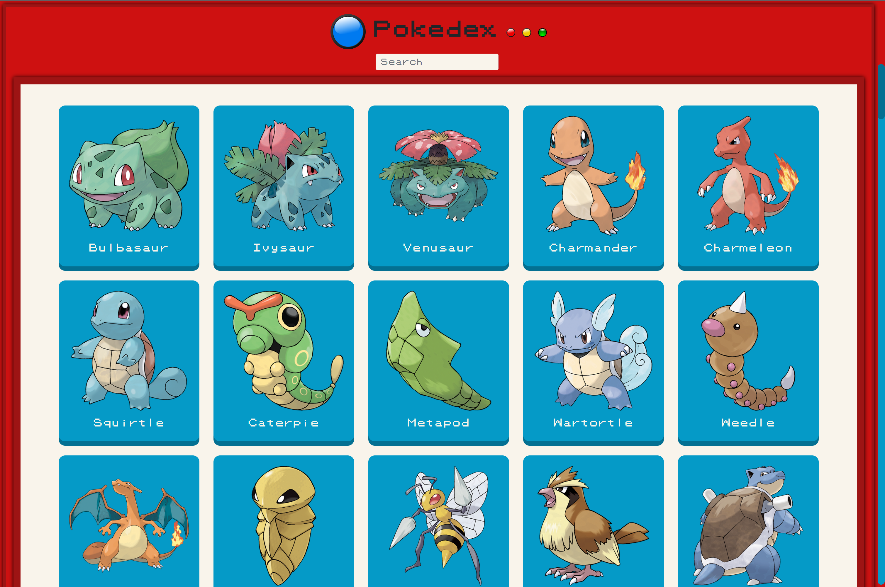

# Pokedex
Javascript application allowing users to access the original list of 151 Pokemon in the Kanto region, search for specific ones by name, and display more details about them if needed by clicking on them.

# Key Features
- Load data from an external source (API), in this case using the PokeAPI (https://pokeapi.co/docs/v2)
- View the original list of 151 Pokemon upon page load
- On user action (click on Pokemon), view more details for that Pokemon in a modal

# Technologies Used
- HTML5, CSS
- Javascript
- Bootstrap
- jQuery

Live site: https://numenot.github.io/pokedex-js-app/
